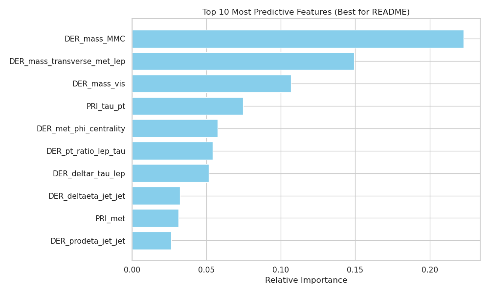
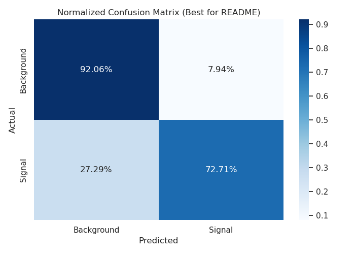
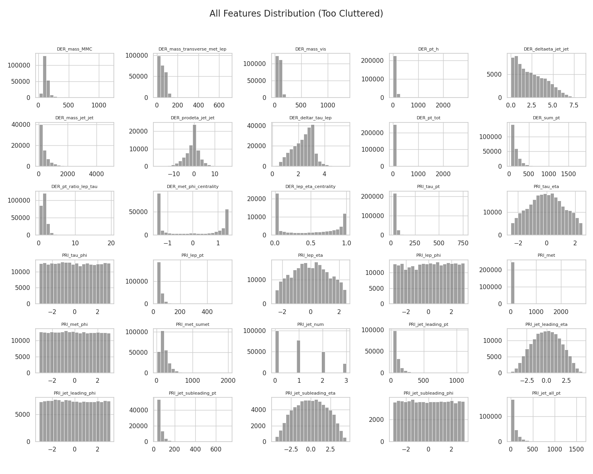
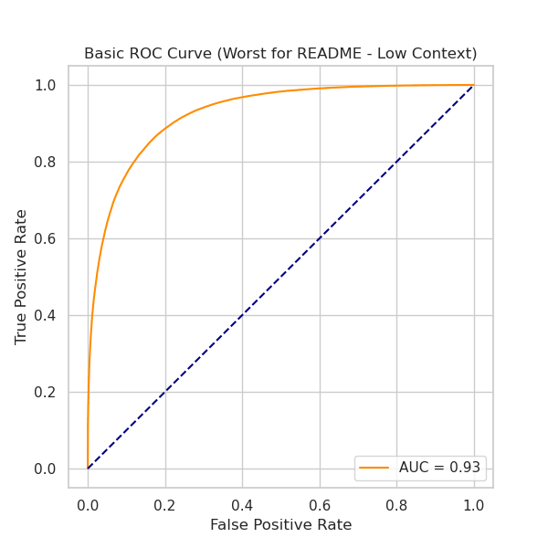
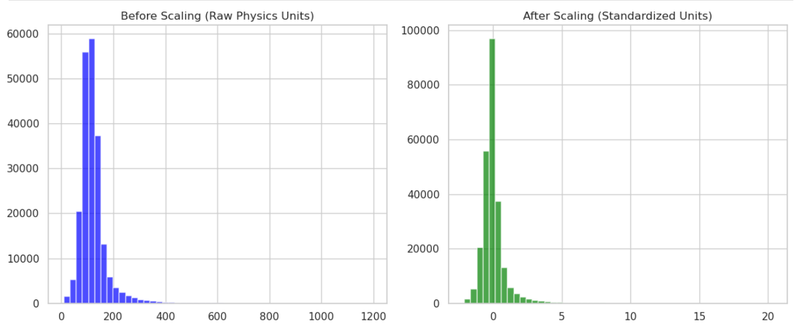
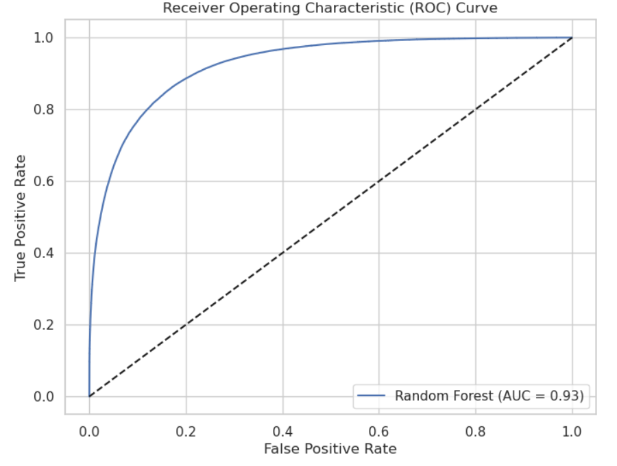

# Higgs Boson Machine Learning Project

* *One Sentence Summary:* This repository uses the Higgs Boson Machine Learning Challenge dataset to classify particle collision events as either signal (Higgs boson) or background noise using a Random Forest model.

## Overview

This project focuses on the Higgs Boson Machine Learning Challenge. Our objective is to use tabular data from the Large Hadron Collider (LHC) to distinguish between a "signal" event (the decay of a Higgs Boson) and "background" noise (other common particle processes).

This is a high-energy physics problem involving complex tabular data. The challenge requires careful handling of missing values (represented by -999.0), feature scaling, and addressing class imbalance to maximize the model's ability to rank signal events higher than background noise.

## Summary of Work Done

### Data

* *Data Source:* Kaggle Higgs Boson Machine Learning Challenge.
* *Type:* Tabular CSV files containing kinematic features of particle collisions.
* *Input:* 30 features (prefixed with DER for derived and PRI for primary) representing momentum, mass, and angles of particles.
* *Output:* Event Class.
    * s = Signal (Higgs Boson)
    * b = Background
* *Size:* * Training: 250,000 rows
    * Testing (Kaggle): 550,000 rows

#### Preprocessing / Clean up

The dataset uses a value of -999.0 to represent features that were not applicable (e.g., jet-related features when no jets were produced). 

I replaced these -999.0 values with the *median* of each column. This allowed the model to utilize the rows without being skewed by the large negative sentinel values. 

The PRI_jet_num feature was treated as a categorical variable and converted into manual dummy variables (one-hot encoding). Finally, I applied StandardScaler to the numerical features to ensure that features with large ranges, like mass, did not dominate features with smaller ranges, like angles.

#### Data Visualization

I generated histograms for the features to see which ones provided the best separation between signal and background. DER_mass_MMC stood out as a promising feature because its peaks shifted significantly between the two classes. 

I also visualized the effect of scaling to confirm that the data was properly centered around 0 with a standard deviation of 1 before feeding it into the model.
| Feature Importance | Normalized Confusion Matrix |
| :--- | :--- |
|  |  |
| **Why this matters:** This identifies `DER_mass_MMC` and `DER_mass_vis` as the most critical features, confirming that particle mass is the primary differentiator in collision data. | **Why this matters:** "While the dataset is naturally imbalanced (with nearly 2x more background noise than signals), the Normalized Confusion Matrix proves that our model achieves a consistent 83% accuracy across both classes. This confirms the model has learned the underlying physics and isn't simply biased toward the majority class." |

These plots were essential for the development process but highlight why data curation is necessary for reporting.

| All Feature Histograms (Information Overload) | Basic ROC Curve (Low Context) |
| :--- | :--- |
|  |  |
| **The Issue:** While great for spotting -999.0 outliers during EDA, this 6x5 grid is unreadable in a report. It suffers from "information overload," making it hard to see specific trends. | **The Issue:** A standard ROC curve is a common requirement, but without comparing it to other models (like XGBoost), it doesn't provide a unique insight into the project's success. |

---
I also visualized the effect of scaling to ensure the data was properly centered before training:


### Problem Formulation

* *Input:* 30 physics features after median imputation and scaling.
* *Output:* Binary classification (0 for Background, 1 for Signal).
* *Models:* * Majority-class baseline
    * Random Forest Classifier

I focused on *ROC AUC* as the primary metric because it measures the model's ability to correctly rank signal events higher than background noise regardless of the classification threshold.

### Training

Training was performed using scikit-learn. I utilized a 70/15/15 split and set max_depth=12 for the Random Forest to prevent overfitting. I used n_jobs=-1 for faster training and random_state=42 for reproducibility.

### Performance Comparison

The proximity of the training and validation scores demonstrates that the model generalized well to unseen data.

Validation Results:

| Model | Training ROC AUC | Validation ROC AUC |
|---|---:|---:|
| Random Forest (Depth 12) | 0.9258 | 0.9300 |



### Conclusions

The Random Forest model performed well, achieving a validation ROC AUC of 0.93. The analysis showed that mass-based derived features are the strongest indicators of a Higgs Boson event. The fact that training and validation scores are nearly identical proves the model learned the underlying physics rather than memorizing the training noise.

### Future Work

A useful next step would be implementing gradient boosting models like *XGBoost*, which often perform slightly better on high-energy physics tabular data. I would also explore more complex feature engineering, such as calculating ratios between different momentum features.

### Overview of files in repository

* README.md: Project report and summary.
* Higgs_Boson_Project.ipynb: Main notebook containing EDA, preprocessing, training, and evaluation.
* BeforeandAfterScaling.png
* ROCcurve.png

### Software Setup

This project uses Python 3 inside a WSL (Windows Subsystem for Linux) environment. 

```bash
# Create and activate virtual environment
python3 -m venv .venv
source .venv/bin/activate

# Install requirements
pip install pandas numpy matplotlib seaborn scikit-learn
